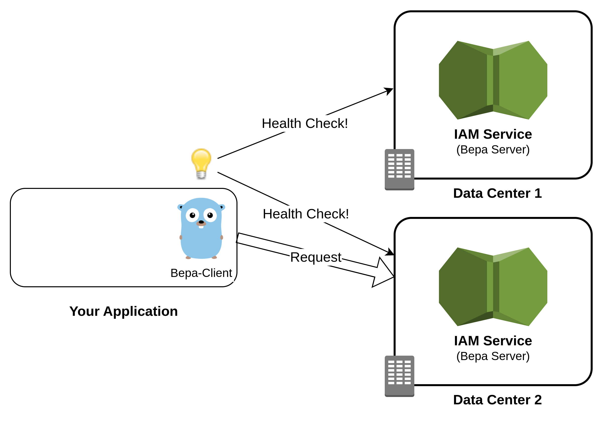

# Bepa Client
> A simple yet powerful library that empowers you using [Bepa2 APIs](https://bepa.sotoon.ir/swagger).

## Table of Contents
* [General Info](#general-information)
* [Quick Start🏎️](#quick-start)
* [Technologies Used](#technologies-used)
* [Features](#features)
* [Architecture](#architecture)
* [Setup](#setup)
* [Project Status](#project-status)
* [Room for Improvement](#room-for-improvement)
* [Acknowledgements](#acknowledgements)
* [Support Notes](#support-notes)
* [External Links](#external-links)
* [Contact](#contact)


## General Information
- There are so many products that need to use Sotoon **IAM Service** aka **Bepa** as their **Identity and Access Management** engine.
- Bepa-Client is a **Golang Library** you can use it to control **the risk of API changes** and other support issues.
- It is under active development and support of Sotoon Integration Tribe.

## Technologies Used
- Golang :)

## Quick Start🏎 

Simply add bepa-client library latest stable version to your `go.mod` file:
> **Note!** Please check latest version tag [hear](https://git.platform.sotoon.ir/iam/golang-bepa-client/-/tags).

### Installation

In to `go.mod` file add:
```mod
module git.cafebazaar.ir/infrastructure/kraken/commander

go 1.19

require (
	git.cafebazaar.ir/infrastructure/bepa-client v1.0.14
)
```
Resolve Golang library from private repository.

```bash
# you should have ssh access to gitlab repo of bepa-client
export GOPRIVATE=git.cafebazaar.ir 
go mod tidy
go mod vendor
```
### Initialization

Then simply use the client in your code:

```golang
import (
	"git.platform.sotoon.ir/iam/golang-bepa-client/pkg/types"
)

func SimpleBepaClientExample() {
    // ... initialize BEPA_URL, accessToken, defaultWorkspaceId, userId
    client, err := client.NewClient(accessToken, BEPA_URL, defaultWorkspaceId, userId)
    if err != nil {
        logger.Error("Cannot make a Bepa client.", zap.Error(err))
        // handle error or kill the process
        return
    }
}

func ReliableBepaClientExample() {
    // ... initialize serverUrls, accessToken, defaultWorkspaceId, userId, bepaTimeout
    client, err := return client.NewReliableClient(accessToken, serverUrls, defaultWorkspace, userUUID, bepaTimeout)
    if err != nil {
        logger.Error("Cannot make a Bepa client.", zap.Error(err))
        // handle error or kill the process
        return
    }
}

```

### Usage

See the [interface.go](pkg/client/interface.go) file to see the full list of API functions. The usage is so simple, just call the function with your intended parameters:

```golang
// Get Workspace Data by name
workspace, err := client.GetWorkspaceByName(workspaceName)

// authorize user with Sotoon IAM System
err := client.Authorize(identity, userType, action, object string)

// identify token with Sotoon IAM System
subject, err := client.Identify(token)


// check if a token's owner has the permission to perform the action on the RRI object
// example: checking if the token's owner has the permission to list compute nodes?
action := "list"
rriObject := "rri:v1:cafebazaar.cloud:d386c6d8-0a0a-4251-b478-2dc03241927d:compute:/core/v1/_/nodes"
err := client.IdentifyAndAuthorize(token, action, rriObject)

if err != nil {
    // the owner of token is Not Authorized to do the action
    return
}

```

## Features

1. Almost all services of Sotoon IAM System (aka Bepa)
2. Client-Side Fail-over.

## Architecture
Brief overview of projects deployment architecture.




## Setup
Please refer to [Makefile](Makefile).

```bash
make build

make test
```

## Project Status

Actively developing and supported.

## Room for Improvement
- Cache health-check result
- Developer API Guide
- Internal Mock Object in the library

## Support Notes
Nothing yet :)

## External Links

- [Commander](https://git.cafebazaar.ir/infrastructure/integration/sib/commander): a successful example usage of the library with *Mocking and Testing*
- [Bepa2](https://git.cafebazaar.ir/infrastructure/integration/sib/bepa2): Sotoon IAM System Repository (Bepa2)

## Acknowledgements
Please refer to **Contributors** Section.


## Contact
Please contact to [Sotoon Integration Backend Team](https://git.cafebazaar.ir/infrastructure/integration/sib/documents)!
